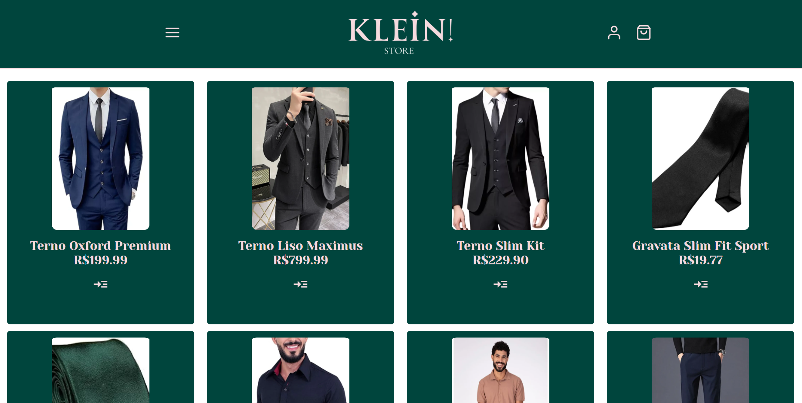

# Clothing Shop made with React and Node.js
  
 
  .
  ### Demo app: https://klein-store.nkportfolio.tech
# About
 This project is a clothing shop that let users buy and pay for they purchases.
 In order to use admin features, please use the following account: email: "admin@gmail.com", password: "12345".
 For the frontend I used React and the backend was made using Node.js.
 This project uses HTTPOnly Signed Cookies and JWT for authentication.
 The API makes the communication between the web page and the database that stores all the data.
 Please, fell free to use all the features moderately.

# Working on
 - [ ] Better UI
 - [ ] Tests with JEST on the backend

# Stacks
  ### Back-end
  - JavaScript
  - Node.js
  - Express
  - Prisma
  - MySQL
  - Cookie-Parser
  - Bcrypt
  - JWT
  - Axios
  - DayJS
  - MercadoPago
  - Multer
  - Node Cron

  ### Front-end
  - React
  - JavaScript
  - Axios
  - Google Oath
  - JWT
  - DayJS
  - JSX
  - CSS

  ### Implantation
  - Website: https://klein-store.nkportfolio.tech
  - API: https://klein-store-api.nkportfolio.tech

  # Author
   Nicolas Klein Faria de Araujo  
   https://nkportfolio.tech
